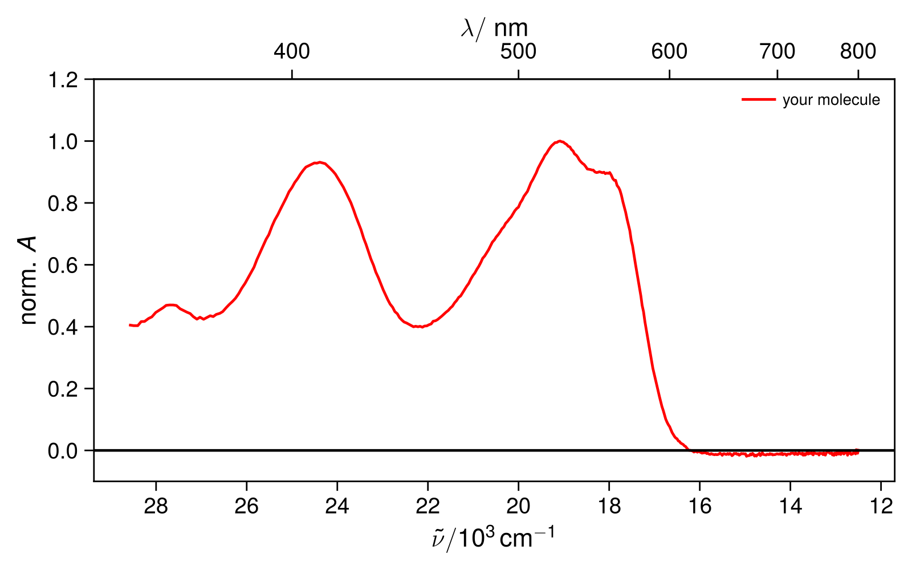
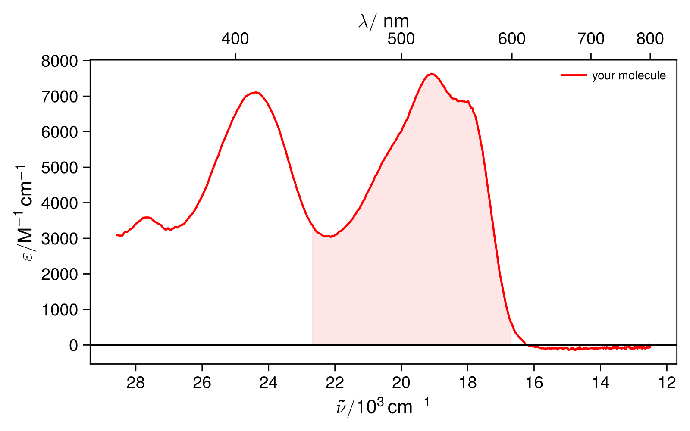
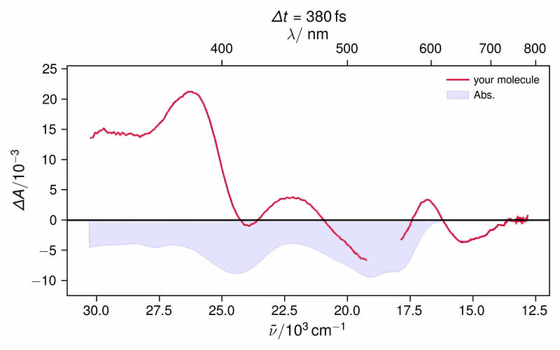
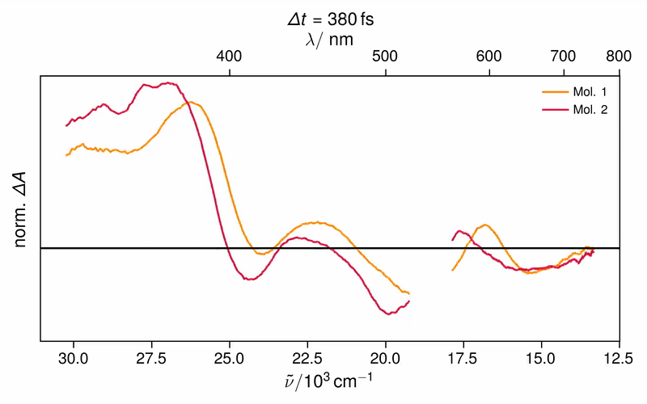
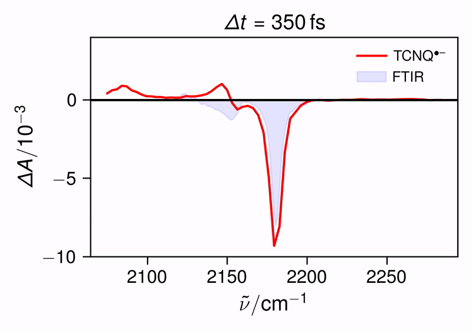

# VautheyLab

**Object-oriented Python toolkit for spectroscopic data analysis** for steady-state and time-resolved spectroscopy, cyclic voltammetry, and QM/MD workflows developed during my PhD at the Vauthey Group (University of Geneva).  

---

## Overview

This package provides modular, object-oriented tools for handling and analyzing experimental data. Objects are created for each type of experiment or analysis technique, while the mathematical processing and analysis happens in the background. 

The pacakge is mainly dedicated for personal use by myself and as of now documentation is sparse. However, as some colleagues were interested in some of the capabilites of this package, e.g. how to easily render movies out of time-resolved spectra (see below), I decided to share it here on GitHub.

Templates for common data analysis workflows are available in `VautheyLab/templates`, and some explanatory example scripts can be found in the `VautheyLab/examples`.  

> Note: As documentation is currently sparse, for more detailed guidance on the capabilities of the package, best to talk to me directly. I can show you how to use it and explain what happens under the hood.

---

## Installation

It is recommended to use **Python 3.10** in a virtual environment (e.g., via `venv` or `conda`).

1. Clone the repository:

```bash
git clone https://github.com/johanneswega/VautheyLab.git
cd VautheyLab
```

2. Install the package in editable mode:

```bash
pip install -e .
```

The -e flag (--editable) allows you to modify the scripts locally while using the package. 

3. As I use LaTeX for nice mathematical axis labels it is also necessary to have LaTeX installed on your machine.

---

## Usage Example

For example, if you measured an absorption spectrum on our Cary50 spectrometer (`abs_file.csv`), you can plot it using the `Absorption` class from `VautheyLab.steady_state`:

```python
from VautheyLab.steady_state import Absorption

a = Absorption(
    files=['abs_file.csv'],
    cuts=[(200, 800)],
    units='wn',
    colors=['r'],
    norm=True,
    labels=['my molecule in X']
)
a.show()
```

<p align="center">
  
</p>

In almost all class objects, arguments like `files`, `cuts`, `colors`, and `labels` are given as **lists**. This makes it easy to plot and compare multiple spectra in the same figure.

You can also directly access the loaded data and analyze it with your own custom code. For example, the wavelength, wavenumber, and absorbance of the *i-th* file are stored as NumPy arrays:
```python
wavelength = a.wl[i]
wavenumber = a.wn[i]
absorbance = a.A[i]
```

However, most of the classes are not just for plotting. Most of them come with built-in analysis methods. Say you want to estimate the oscillator strength and radiative rate constant for the $S_1 \leftarrow S_0$ transition by integrating the absorption spectrum between 440–600 nm using the Strickler-Berg analysis. For this, xou just need to pass two extra arguments when creating the Absorption object:
- `conc` → concentration in M
- `pathlength` → optical pathlength in cm

With these two additional init arguments, the class will directly calculate the extinction spectrum. To calcualte the oscillator strength you can then call `calc_oscillator_strength()` method of the class: 

```python
from VautheyLab.steady_state import Absorption

# concentration in M
c = 24e-6
# pathlength in cm
l = 1

# initialize absorption class
a = Absorption(files=['abs_file.csv'],
             cuts=[(350, 800)],
             colors=['r'],
             units='wn',
             conc=[24e-6], 
             pathlegnths=[1],
             labels=['your molecule'])

# use calc_oscillator_strength(limits, n, nu0, file_index)
# integration limits as list in nm
# refractive index 
# center frequency in kk
a.calc_oscillator_strength([440, 600], 1.421, 18.8, 0)
a.show()
```
<p align="center">
  
</p>

This will automatically calculate and output the following useful properties: 

- Oscillator strenth calculated over the region: $f = 0.13$
- Transition Dipole Moment: $\mu_{\text{TDM}} = 3.75 \text{D}$
- Radiative rate constant $k_{\text{rad}} = 5.81 \times 10^8 \text{s}^{-1}$
- Radiative lifetime $\tau_\text{rad} = 17.2 \text{ns}$

Of course this is not the only method of the `absorption` class and a plethora of other methods are implemented like:
- `get_concentration` (get concentration of sample providing exctinction coefficeint)
- `find_max` (find wavelength of maximum absorbance)
- `find` (find abs at a certain wavelength) 
- `plot_calculated` (compare with Gaussian output convolved calculated spectrum / btw the class works also for FT-IR spectra)
- `solvchrom` (make a solvatochromic plot of all files when solvent names are given as attributes, solvent parameters are directly extracted)
- `plot_diff` (plot difference spectra)
...

So the modular approch is pretty versatile I would say. I don’t have time (yet) to fully document every module. As you can see this section alone is already long just for absorption. If you have questions and problems either ask me or study how things are done under the hood by looking at the implementations of the respective class objects. For instance, the `absorption`class is implemented in `VautheyLab/absorption.py`. In this file you’ll find:

- all initialization arguments
- all analysis methods of the class

and can see how things are implemented under the hood. Comments are provided in the code.

Whenever I get time, I’ll keep adding more examples for different experiments/analysis routines in the `VautheyLab/examples` folder. 

---
## Render Movies of Transient Spectra

What most people are usually interested in is using this package to easily render movies from transient absorption (TA) spectra. Several examples are provided in:

`VautheyLab/examples/transient_absorption/movie`

For this, the TA data needs to be stored in a `.npy` file containing the **time**, **wavelength (or frequency)**, and **ΔA** as NumPy arrays.

Instructions and example scripts to convert raw TA `.txt` files into `.npy` format can be found in:

`VautheyLab/examples/convert_to_npy`

Once you have a `.npy` file it is pretty straight-forward to render a movie: 

```python
from VautheyLab.transient_absorption import Movie

m = Movie(files=['dA1.npy'],
          scatter=[(520, 560)],     # scatter region to exclude (optional)
          experiment='femto',       # experiment type 
          t_cuts=[0.3, 1800],       # time cuts in ps if experiment = 'femto' else in ns (optional)
          wl_cuts=[330, 780],       # wavelength cuts in nm (optinal)
          colors=['crimson'],   
          labels=[r'your molecule'],
          movname='movie.mp4',      # file name to save
          ylim=[-12.5, 25.5],       # file name to save (limits of y-axis, optional)
          before=True,              # decide to plot traces before (optional)
          steady_state=[['abs.txt', (330, 700), -9.5, 'b', 'Abs.']])

# steady state spectra provided as lists [filename, cuts, scale factor, label]
# absorption/emission spectra can be exported from respectrive classes with export=True 

m.render()
```



Most arguments are optional but give fine control over the appearance of the movie. Typical rendering times are often below one minute. The `steady_state` argument is particularly useful as it lets you overlay ground-state absorption/emission spectra, literature spectra (e.g. radical ions), or other references directly into the movie.

It is also easy to compare multiple TA spectra in one movie: 

```python
from VautheyLab.transient_absorption import Movie

m = Movie(files=['dA1.npy', 'dA2.npy'],
          scatter=[(520, 560), (520, 560)],
          colors=['darkorange', 'crimson'],
          labels=[r'Mol. 1', r'Mol. 2'],
          movname='comp.mp4',
          t_cuts=[0.3, 1800],
          wl_cuts=[330, 750],
          ylim=[-0.65, 1.2],
          before=False,
          norm=True, # nomalize spectra (optional)
          normat=[0.2, 380], # normalize spectra at a specific (delay, wavelength)
          yticks=False) # remove y-ticks of the plot

m.render()
```



For TRIR data, you can directly use `.pdat` files or again convert custom txt files to `.npy`:

```python
from VautheyLab.transient_absorption import Movie

m = Movie(files=['dA.pdat'],
        t_cuts=[0.3, 500],
        IR=True, # for TRIR
        before=True,  
        figsize=(5, 3.5), # size of the figure (optional)
        labels=[r'TCNQ$^{\bullet –}$'],
        colors=['r'], 
        steady_state=[['FTIR.txt', (1e3, 3e3), -8, 'b', 'FTIR']],
        movname='TCNQ.mp4', 
        ylim=[-10, 4]) # limit of the y-axis plot

m.render() 
```

<p align="center">
  
</p>

---

## Capabilities of the Package

Below is a brief overview of the main modules of the package and the classes they provide.  
Whenever possible, check out `VautheyLab/examples` for concrete workflows and real analysis use cases.

---

### `VautheyLab.steady_state`

Contains classes for steady-state spectroscopic experiments:

- `Absorption` — absorption spectra handling and analysis (described above)
- `Emission` — emission and excitation spectra; plot together with absorption; includes solvatochromic analysis tools
- `Ex_Em_Map` — visualization of 2D excitation–emission maps (slices or movies)
- `FluQ` — fluorescence quantum yield calculations using the relative method with full error propagation

---

### `VautheyLab.transient_absorption`

Classes for time-resolved transient absorption experiments.  
Works for UV–vis/NIR TA, TRIR, and nsTA data:

- `Movie` — generates animated TA spectra (great for visualizing dynamics and comparing spectral evolution, described in detail above)
- `Overview` — spectral slice overview plots at selected time delays
- `Kinetics` — kinetic traces at selected wavelengths
- `Contour` — contour maps of TA datasets
- `Compare_Spectra` — compare multiple TA spectra at a given delay across in different subplots
- `Compare_Kinetics` — compare multiple kinetic traces in different subplots
- `Compare_Overviews` — compare spectral slices from different experiments in different subplots
- `twoDIR` — visualization of 2D-IR spectra

To use these classes, the data first needs to be converted into a `.npy` file containing the time, wavelength, and ΔA arrays.  
Examples on how to generate these `.npy` files from raw `.txt` TA data can be found in the `examples` folder.

The `transient_absorption` module also includes several helper functions to:

- convert between `.npy`, `.txt`, and `.pdat` formats  
- export data to `.txt` files 

---

